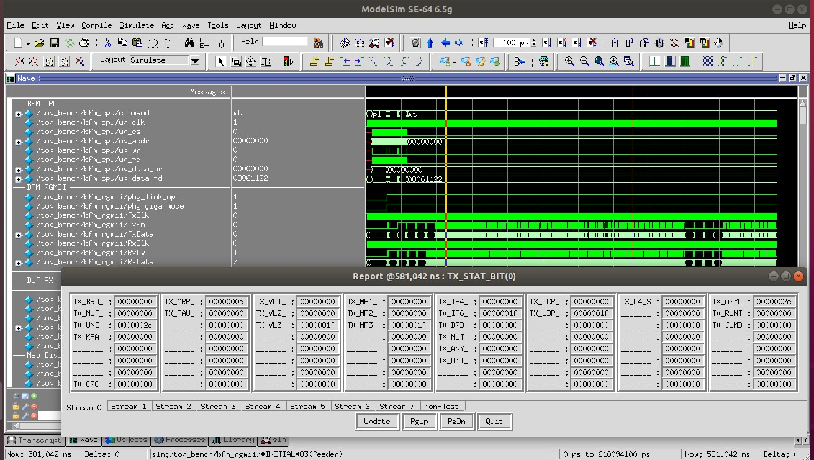

# triple-speed-ethernet-tester
10/100/1000M Ethernet tester

# Overview 
This is the FPGA logic of an Ethernet Tester for 10/100/1000Mbps wire-speed test and measurement. Utilizing around 12k LUTs and a datapath capable of parsing IPv4/IPv6 dual stack and 3 layers of VLAN and MPLS, the small size and full functionality make it ideal for embedded and VNF applications.

The full system simulation includes BFMs of host CPU(text script based) and Ethernet interface(PCAP dump file based).
This project targets both Altera and Xilinx devices.

### Simulation with customized GUI console:

